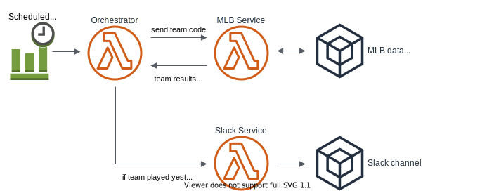

## bball-slackbot-upgraded

A simple troll bot that sends messages to a specified user on slack when their most hated baseball team wins.

This project started as a node script we could run locally, but we wanted to learn how to properly setup AWS Lambdas, practice test driven development, and create a more professional architecture with better separation of concerns.

Does a project of this scale need lambdas? No. No it does not.

Original project here: https://github.com/snpdolan/bball_slackbot
Thanks to [snpdolan](https://github.com/snpdolan)

---

### Installation

The root package.json is in the `workspaces/` directory, using yarn workspaces

    cd workspaces
    yarn

If you do not have [Serverless](https://serverless.com/) installed, [install it!](https://serverless.com/framework/docs/getting-started/)

**NOTE** I did not actually get vscode-jest to work properly. It wasn't worth the time for me to figure it out as I personally love running tests with `--watch` in a terminal. Below are notes on what I did when I thought it was working properly.

To use the [vscode-jest](https://github.com/jest-community/vscode-jest) extension, you need to point your workspace jest settings to package.json (or jest config) and node modules:

    {
      "jest.pathToConfig": "[your path here]\\bball-slackbot-upgraded\\workspaces\\serverless-wrappers\\package.json",
      "jest.pathToJest": "node [your path here]/bball-slackbot-upgraded/workspaces/node_modules/jest/bin/jest.js"
    }

I also had to add the following in `workspaces/serverless-wrappers/package.json` for `--watch` to work:

    "jest": {
      "modulePathIgnorePatterns": [
        "node_modules"
      ]
    }

---

### Usage

Deploy from `workspaces/serverless-wrappers`.

#### workspaces/mlb-api

To add/change any code, the typescript compiler can be started in watch mode with `yarn start`, and tests run with `yarn test`. This was setup with TSdx.

This is intended to be a library, but there is a `main()` in `/src/mlbService.ts` and `/src/mlbController.ts` that can be uncommented and run.

#### workspaces/serverless-wrappers

To run tests, run

    tsc --watch
    yarn test

I have test scripts setup as `jest --watch`, change as you like in `package.json`

Instead of the above, you can also setup the test script like `tsc && jest`

Not sure why, but the typescript, jest, webpack, ts-jest setup would take 45 seconds to over a minute to run on my machine. Having typescript compile first, then test reduced this to 15 to 20 seconds. I think something is wrong either with the jest setup, or my WSL, as a lot of performance posts seen on StackOverflow mention large angular projects taking ten seconds, etc.

For all serverless functions make sure you are in `workspaces/serverless-wrappers/` to access the serverless config in `serverless.yml`

To deploy, run

    serverless deploy

To check function logs, i.e. function runBot, run

    serverless logs -f runBot

Run the function locally with

    serverless invoke local -f runBot

as well as running the function on AWS

    serverless invoke -f runBot

I set up serverless to read aws credentials from `~/.aws/credentials` generated by the aws cli, which looks like this:

    [serverless-admin]
    aws_access_key_id=[someid]
    aws_secret_access_key=[somekey]

If you remove the `profile: serverless-admin` from `serverless.yml`, it will try to use the `[default]` profile in `~/.aws/credentials`

---

### Improvements

#### workspaces/mlb-api

The IMLBApi interface is just a get function - since I had used the mlbgames package previously, I was thinking in terms of the one function the package provides. In retrospect I think the functions defined in `mlbService.ts` (getAllGamesOnDate, getGamesPlayed) should be defined at the interface level, and have better names. listGamesOnDate, overloaded with no parameters for all games and a teamCode for games played by that team?

#### workspaces/serverless-wrapper

Improve the role/policy on the individual lambdas. Policies -> PolicyDocument -> Statement -> Resource is currently set to "\*" (all). I tried restricting the resources here previously but somehow removed logging permissions from the runBot handler.

The dependency injection in `handler.ts` lines 8 and 18 could be moved outside of `handler.ts`.

---

### Random notes

All `serverless` commands can be run with `sls`

The initial setup for this project ran `serverless create` in the root directory, which created and deployed successfully. We decided to use yarn workspaces, and webpack did not automatically handle `node_modules` being outside the workspace where `serverless create` was run. To fix, the externals line in webpack.config.js is changed from

    externals: [nodeExternals()],

to

    externals: [nodeExternals({
      modulesDir: path.resolve(__dirname, '../node_modules')
    })],

I think it would have been easier to install jest in root or `workspaces/`, but I wanted to have each workspace have its own dependencies in case a service wasn't in javascript/typescript. I was having issues getting jest to work correctly with typescript, and ended up using [this repo](https://github.com/tgensol/serverless-typescript-jest) as a template.

After creating the three lambdas, I found out about AWS step functions. That might be a cleaner solution, although the current setup with an orchestrator lambda might be more portable if you wanted to change cloud providers.

For the mlb-api workspace, I wanted to test [TSdx](https://github.com/jaredpalmer/tsdx) as it was recommended in the typescript handbook for developing libraries. So far I have not noticed any downsides, but I do not have extensive experience with typescript yet. The jest tests take about 30 seconds to run, but I am not sure if that is an issue with TSdx, or my local machine/wsl setup.

It took me a bit to wrap my head around dependency injection while also not exposing the dependency to the end user. Under the hood we are using the npm package `mlbgames` due to it having the most straightforward way of finding if a team won on a given day. Initially I created one function taking the api as an argument (yay dependency injection) but of course if this is the function exposed to the consumer, they would have to import mlbgames and send it as an argument. Currying the function ended up being what I was looking for; the original curry function:

    _getAllGamesOnDate = api => date => {}

could be easily tested with a mock api thanks to dependency injection, and the end user would get the resulting partial function:

    export const getAllGamesOnDate = _getAllGamesOnDate(mlbApi);

I have included 'draw' in gameResult status, but I did not include logic to check for double header draws, as my limited research in baseball shows that ties are incredibly rare. Also the message strings are only decided by wins/losses, but I did include scoreDifference so there could be different messages based on how much a team won/lost by.

#### Jest Issue

I ran into an issue with Jest that I'm unsure of how to google. It may be a bug, or I am misunderstanding how Jest handles some async tests.

In the 'getGamesPlayed() integration tests' describe block, there are two tests that get the games on 04/20/2019, one for Minnesota ('min') and one for Baltimore ('bal'). On this day these teams played a double header, so I wanted to make sure the code correctly returned two game objects for each team code i.e., `getGamesPlayed('min', new Date('April 20, 2019'))` and `getGamesPlayed('min', new Date('April 20, 2019'))`.

When you run these tests individually, with `test.only` on either or both, or only that describe block with `describe.only`, the tests run successfully. But if you run all tests, one or both will fail.

There is some kind of test collision happening here. They always fail at the team code validation:

    if (!mlbTeamsJSON.hasOwnProperty(teamCode)) {
      throw new Error(`Invalid team code '${teamCode}'`);
    }

Now if it were getting the correct function call, the error would log as `Invalid team code 'min'` or `Invalid team code 'bal'` (and furthermore it shouldn't actually throw the error...) But what it actually shows is:

    Invalid team code 'this can be any code'

This is from another test inside \_getGamesPlayed() unit tests. Interestingly enough, this test passes while it shouldn't. This test was written before the function validated teamCode, with the idea that it was just testing that teamCode would be a string. After adding the above validation, this test should no longer pass, since `'this can be any code'` is not a valid team code. The test still passes, but the exception gets thrown in the other integration test!

Fixing the \_getGamesPlayed() unit test to pass a valid team code fixes all tests.
